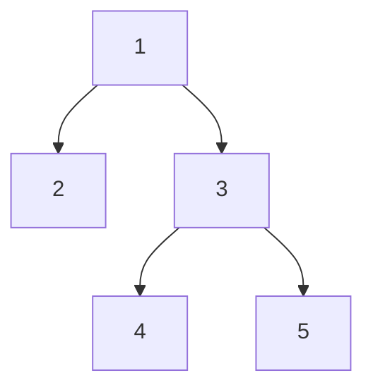

# 解关于树的问题的一些思路

1. 构造一棵二叉树： 想办法构造出根节点，然后递归的构造左右子节点(树).

   例题： [从前序与中序遍历序列构造二叉树](https://leetcode-cn.com/problems/construct-binary-tree-from-preorder-and-inorder-traversal/), 解这道题，还需要了解二叉树的前中后序遍历结果，即
    * `[根节点, [左子树的前序遍历结果], [右子树的前序遍历结果]]`
    * `[[左子树的中序遍历结果]，根节点，[右子树的中序遍历结果]]`
    * `[[左子树的后序遍历结果], [右子树的后序遍历结果], 根节点]`

2. 比较两个二叉树是否相等，可以将二叉树序列化为字符串再进行比较,例如下面一棵树

可以序列化为`1,2,#,#,3,4,#,#,5,#,#`,每棵不同子树序列化的结果都是唯一的，注意序列化时需要加入分割符`,`